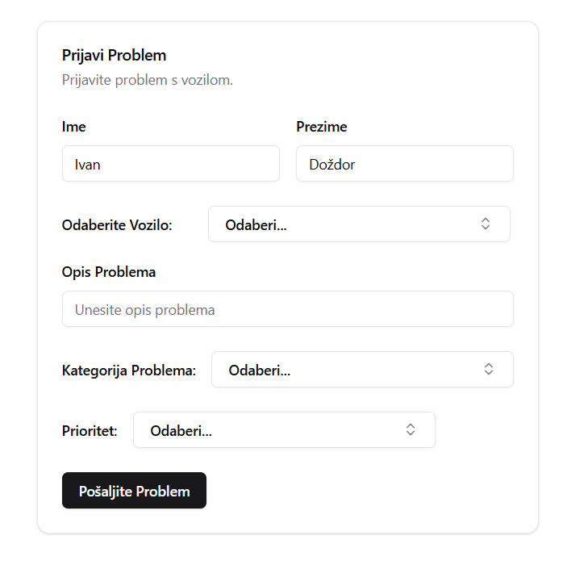
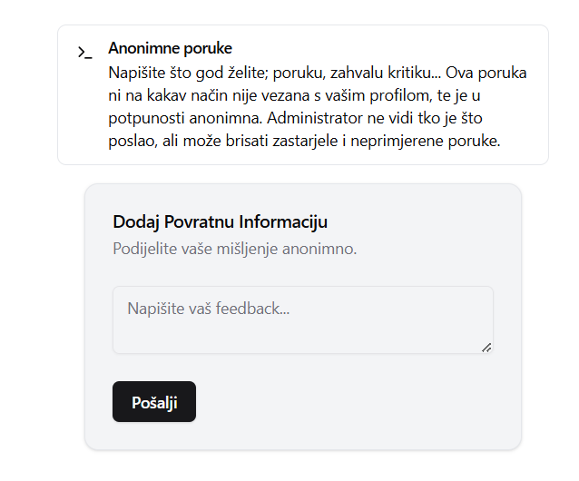
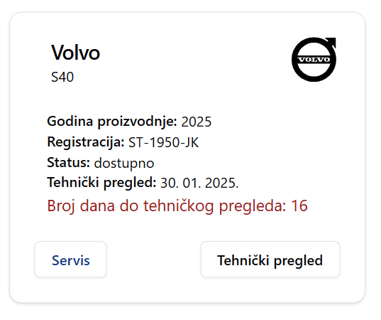
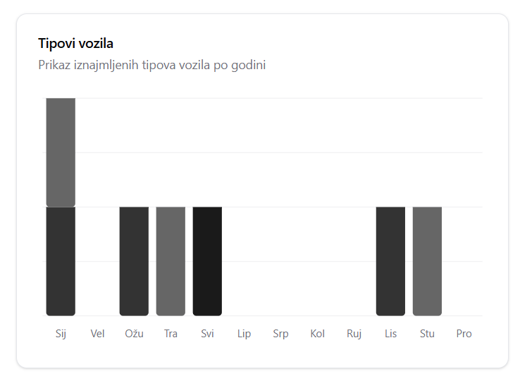
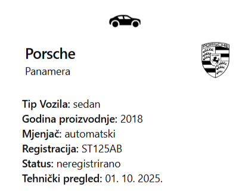
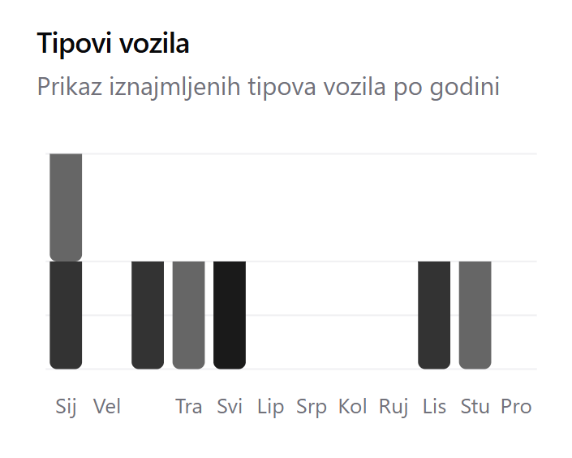
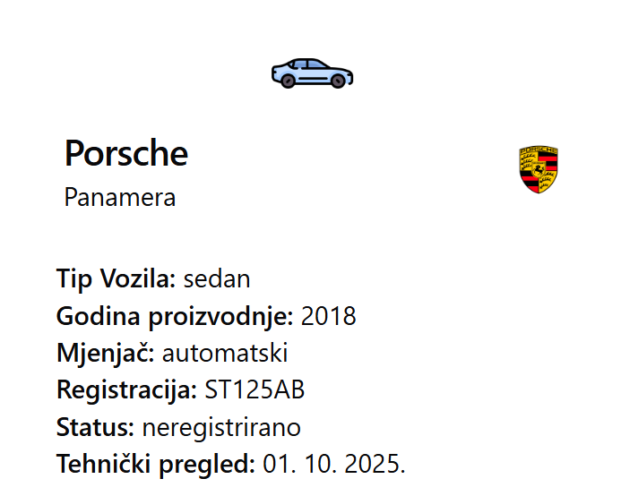
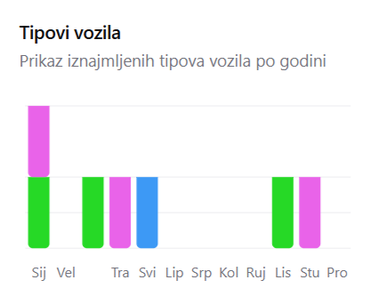

# Fleet-Management-Sustav

# Važno!
Nakon što uvezete datoteke u bazu, logirajte se sa sljedećim podacima:
   - **Korisničko ime**: admin@admin.hr
   - **Lozinka**: admin

## Datoteke za uvoz
**Važno!** Potrebno je importati bazu u kojoj su spremljeni podaci korisnika, jer radi sigurnosnih razloga, kod ovakvog tipa aplikacije, jedino ima smisla da administrator može dodavati korisnike.
Imate sljedeće exportirane JSON datoteke u folderu **database**:
- `fleetDatabase.Feedback.json`
- `fleetDatabase.Korisnici.json`
- `fleetDatabase.Problemi.json`
- `fleetDatabase.Rezervacije.json`
- `fleetDatabase.Vozila.json`

## Koraci za uvoz testnih podataka u MongoDB
Nakon što napravite svoju bazu fleetDatabase (pazite na veliko i malo slovo), napravite kolekcije Feedback, Korisnici, Problemi, Rezervacije i Vozila. 
_(Ako želite drugačiji naziv baze podataka, uredite datoteku .env unutar foldera server, da odgovara vašoj bazi)_

Možete koristiti **MongoDB Compass** za uvoz podataka putem grafičkog sučelja:
   - Otvorite MongoDB Compass i povežite se s vašom bazom podataka.
   - U lijevom izborniku odaberite kolekciju u koju želite uvesti podatke.
   - Kliknite na "Import Data", odaberite JSON datoteku iz foldera "database" i slijedite upute za uvoz.
     


## Pokretanje aplikacije

Nakon što su podaci uvezeni, slijedite ove korake za pokretanje backend i frontend servera: (s preduvjetom da imate preuzeto sve potrebno za pokretanje - Node.js i MongoDB)

1. **Idite u backend direktorij** i pokrenite:

   ```bash
   npm run start
   ```

2. **Idite u frontend direktorij** i pokrenite:

   ```bash
   npm run dev
   ```

3. Server bi sada trebao biti pokrenut i **možete se prijaviti s slijedećim podacima:**

   - **Korisničko ime**: admin@admin.hr
   - **Lozinka**: admin

Nakon ovoga, možete za potrebe testiranja dodavati svoje korisnike, ali pamtite njihove lozinke, jer će u bazi biti skrivne.
  
**Fleet Management Sustav** je aplikacija namijenjena organizacijama za upravljanje službenim vozilima. Sustav omogućuje administratorima jednostavno upravljanje voznim parkom, dok zaposlenici mogu pregledati dostupnost vozila i podnositi zahtjeve za njihovu rezervaciju.

## 🌟 Ključne značajke

### Za zaposlenike:
- **Rezervacija vozila**: Zaposlenici mogu pregledati dostupnost vozila i slati zahtjeve za njihovu rezervaciju.
- **Prijava šteta**: Jednostavna prijava problema ili šteta na vozilima putem aplikacije.
- **Povijest rezervacija**: Pregled svih prethodnih rezervacija na jednom mjestu.
- **Povratne informacije**: Mogućnost slanja povratnih informacija administratorima, anonimno ili imenovano.

### Za administratore:
- **Upravljanje korisnicima**: Dodavanje i upravljanje zaposlenicima u sustavu.
- **Praćenje vozila**: Upravljanje voznim parkom, slanje vozila na tehnički pregled i pregled njihovog statusa.
- **Kalendar rezervacija**: Detaljan uvid u kalendar za efikasno planiranje.
- **Povijest problema**: Evidencija svih prijavljenih problema ili šteta na vozilima.
- **Prilagodba sustava**: Opcija promjene izgleda aplikacije (standardni i šareni mod).

## 📸 Prikaz sučelja
Slike sučelja aplikacije:


<p align="center">
  
  
</p>
<p align="center">

  
    

</p>

## 💡 Često postavljana pitanja (FAQ)

1. **Zašto ne mogu samostalno kreirati račun?**  
   Registraciju korisnika obavlja administrator kako bi se osigurala sigurnost i ovlaštenje unutar organizacije.

2. **Kako mogu prijaviti štetu na vozilu?**  
   Koristite opciju "Prijava šteta" u aplikaciji. Administrator će dobiti obavijest i poduzeti potrebne korake.

3. **Može li se prilagoditi izgled aplikacije?**  
   Da, aplikacija nudi dvije teme: standardni crno-bijeli dizajn i šareni mod. Promjenu možete izvršiti u postavkama.
<p align="center">

  
    

</p>
Aplikacija je izgrađena koristeći React, Express, MongoDB, ShadCN, i Tailwind CSS za pružanje modernog korisničkog sučelja te skalabilne backend arhitekture.
<p align="center">

  
    

</p>
