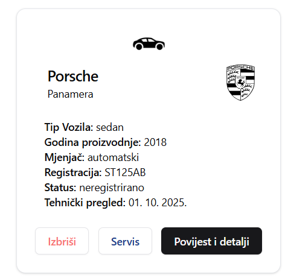

# Fleet-Management-Sustav

<p align="center">
  
  
  
</p>

## Datoteke za uvoz
**Važno!** Potrebno je importati bazu u kojoj su spremljeni podaci korisnika, jer radi sigurnosnih razloga, kod ovakvog tipa aplikacije, jedino ima smisla da administrator može dodavati korisnike.
Imate sljedeće exportirane JSON datoteke u folderu **database**:
- `fleetDatabase.Feedback.json`
- `fleetDatabase.Korisnici.json`
- `fleetDatabase.Problemi.json`
- `fleetDatabase.Rezervacije.json`
- `fleetDatabase.Vozila.json`

## Koraci za uvoz podataka u MongoDB

Možete koristiti **MongoDB Compass** za uvoz podataka putem grafičkog sučelja:
   - Otvorite MongoDB Compass i povežite se s vašom bazom podataka.
   - U lijevom izborniku odaberite kolekciju u koju želite uvesti podatke.
   - Kliknite na "Import Data", odaberite vašu JSON datoteku i slijedite upute za uvoz.
     

Ili **Otvorite terminal** i upišite sljedeće naredbe za uvoz svake JSON datoteke u MongoDB:
   - Pokrenite sljedeće za svaku datoteku:

   ```bash
   mongoimport --db fleetDatabase --collection Feedback --file fleetDatabase.Feedback.json --jsonArray
   mongoimport --db fleetDatabase --collection Korisnici --file fleetDatabase.Korisnici.json --jsonArray
   mongoimport --db fleetDatabase --collection Problemi --file fleetDatabase.Problemi.json --jsonArray
   mongoimport --db fleetDatabase --collection Rezervacije --file fleetDatabase.Rezervacije.json --jsonArray
   mongoimport --db fleetDatabase --collection Vozila --file fleetDatabase.Vozila.json --jsonArray
   ```

## Pokretanje aplikacije

Nakon što su podaci uvezeni, slijedite ove korake za pokretanje backend i frontend servera: (s preduvjetom da imate preuzeto sve potrebno za pokretanje reacta)

1. **Idite u backend direktorij** i pokrenite:

   ```bash
   npm run start
   ```

2. **Idite u frontend direktorij** i pokrenite:

   ```bash
   npm run dev
   ```

3. Server bi sada trebao biti pokrenut i **možete se prijaviti s slijedećim podacima:**

   - **Korisničko ime**: admin@admin.hr
   - **Lozinka**: admin
